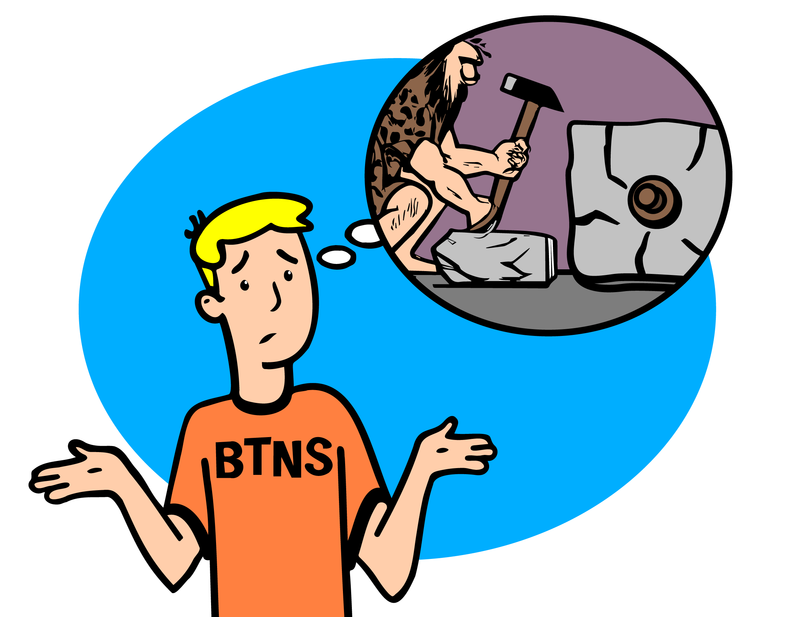
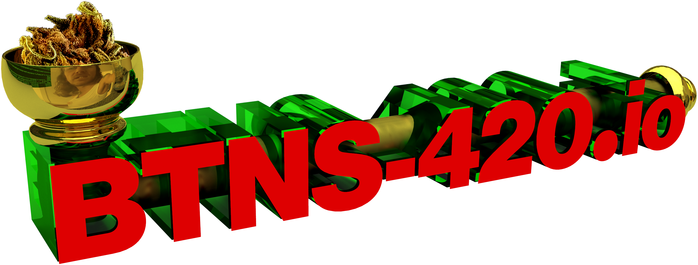

# Broadcast Token Naming System (BTNS)

This is the official repository for Broadcast Token Naming System (BTNS). 

The **`BTNS`** operates on the **`Counterparty`** platform using the `broadcast` feature. 

**`BTNS`** and **`BTNS-420`** are **NOT** _officially_ endorsed by the **`Counterparty`** project. 

**`BTNS-420`** was copied, almost entirely, from the existing **`Counterparty`** platform features. 

This is a personal hobby project, to allow for experimentation with additional token features and functionality.

# Disclaimer 
`BTNS` is a bleeding-edge experimental protocol to play around with token functionality on **`Bitcoin`** and **`Counterparty`**. This is a hobby project, and  I am **NOT** responsible for any losses, financial or otherwise, incurred from using this experimental protocol and its functionality. 

Science is messy sometimes... _**DO NOT**_ put in funds your not willing to lose!

# BTNS Specs

Name                          | Title                                     |  Author / Owner        | Status        |
----------------------------  | ----------------------------------------- | ---------------------- | ------------- |
[BTNS](./docs/BTNS.md)        | Broadcast Token Naming System (**BTNS**) | Jeremy Johnson (J-Dog) | Accepted      |
[BTNS-420](./docs/BTNS-420.md)| BTNS Token Standard (**BTNS-420**)        | Jeremy Johnson (J-Dog) | Draft         |

# BTNS Indexer
- Coming soon

# BTNS Explorers
- Coming soon

# BTNS APIs
- Coming soon

# BTNS Wallets
- [Freewallet](https://freewallet.io/)

# Counterparty Platform
**`Counterparty`** is the swiss army knife of Bitcoin, and I encourage **ALL** developers looking to build on Bitcoin to take the time to go down the **`Counterparty`** rabbit hole.
- [Counterparty Website](https://counterparty.io)
- [Counterparty Documentation](https://docs.counterparty.io)
- [Counterparty API](https://api.counterparty.io)
- [FreeWallet](https://freewallet.io)

# Donate
If you find this project interesting, please consider making a donation of BTC, `Counterparty` assets, or `BTNS` tokens to `1BTNShGvQjDucRCwSm3dhiiunjNdrZmXJL`

# BTNS Logos

## BTNS Logo

## BTNS-420 Logo

